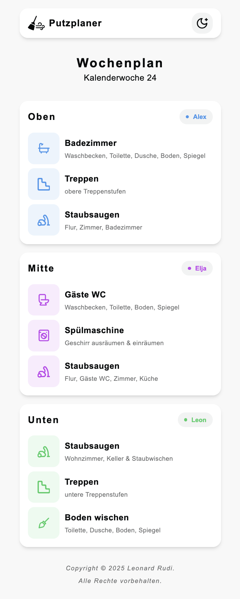
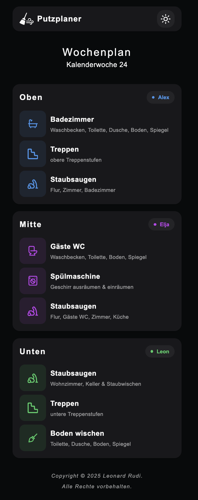

# Putzplaner
   [](#)

**Putzplaner** ist eine Webanwendung, die wöchentlich die Aufgaben im Haushalt übersichtlich darstellt.
Für jede Kalenderwoche zeigt die App, welche Person welche Aufgabe in welchem Bereich übernimmt.

Dieses Projekt ist mein erstes mit Next.js und entstand aus einem echten Problem: In meiner Familie haben wir die Haushaltsaufgaben bisher auf Zetteln notiert, was oft unübersichtlich und fehleranfällig war. Mit dem Putzplaner habe ich eine digitale Lösung geschaffen, die die Aufgaben klar verteilt und den Überblick erleichtert.

# Preview

<table style="width: 100%; table-layout: fixed; border-collapse: collapse;">
  <thead>
    <tr>
      <th style="text-align: center;">Light Theme</th>
      <th style="text-align: center;">Dark Theme</th>
    </tr>
  </thead>
 <tbody>
    <tr>
      <td style="padding: 10px;">
        
      </td>
      <td style="padding: 10px;">
        
      </td>
    </tr>
  </tbody>
</table>


## Features
- Anzeige aktueller Kalenderwoche  
- übersichtliche Karten für jeden Bereich mit zugeordneten Personen  
- Aufgaben mit Icons, Titel & Beschreibung  
- Responsives Design dank Tailwind CSS  
- einfache Installation via Docker

## Installation (Docker)
1. **Download Docker Image**
    
    *Use Docker Hub to pull Image*
    ```bash
    docker pull leonrudi/putzplaner:latest
    ```

    **OR**

    *Clone the repository*
    ```bash
    git clone https://github.com/LeonRudi/Putzplaner.git
    cd Putzplaner
    ```
    *Then build the Image*
    ```bash
    docker build -t leonrudi/putzplaner:latest .      
    ```  
2. **Container starten**
     ```bash
    docker run -d --name putzplaner -p 3000:3000 --restart unless-stopped leonrudi/putzplaner:latest
     ```

> Nach dem Start des Containers im Browser `http://localhost:3000` auf dem Host aufrufen.

## Technologien & Tools

- **Framework:** Next.js v15 mit App-Router
- **Sprache:** TypeScript (React-Komponenten in `.tsx`) 
- **Styling:** Tailwind CSS v4 
- **Container:** Docker (`Dockerfile`, `.dockerignore`)  

## Hinweise

Es existiert aktuell keine dynamische Datenbank-Anbindung oder Editing-UI. Alle Aufgaben werden im Code definiert.  
Um das Projekt zu erweitern, könnte z.B. eine API/Datenbank integriert oder eine Bearbeitungsoberfläche implementiert werden.  
Da der Plan für den persönlichen Gebrauch im Haus entwickelt wurde, wurden diese Funktionen nicht benötigt.